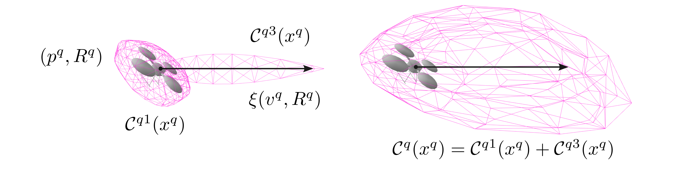
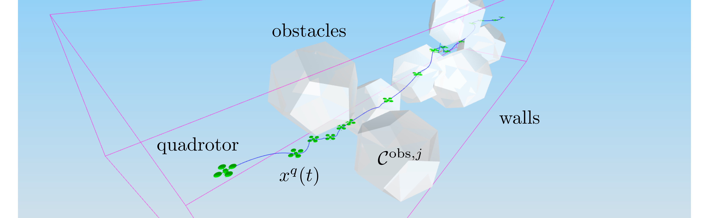
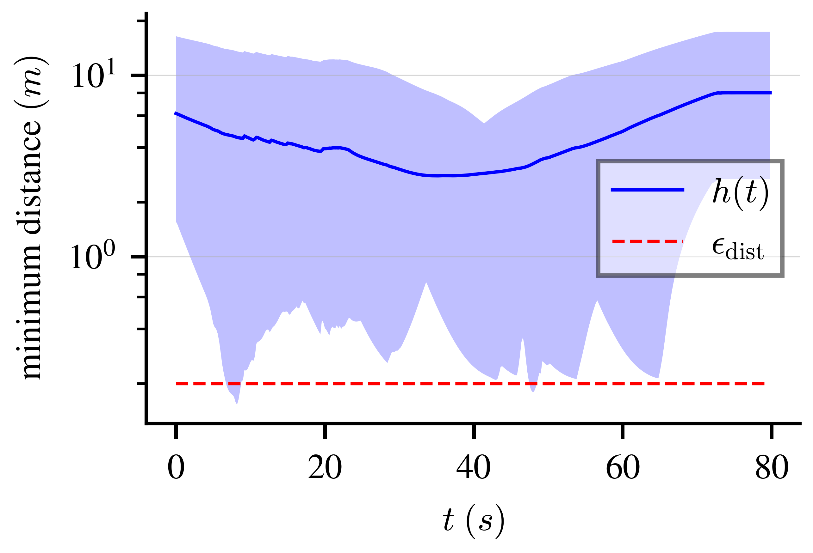

# cbf-convex-maps
This repository provides a method to enforce control barrier function (CBF) constraints between state-dependent convex sets, defined as smooth and strongly convex maps (see the reference below).

We provide the following features:
- Geometry classes to define state-dependent strongly convex sets (smooth and strongly convex maps).
- Ipopt solver interface to compute the minimum distance between strongly convex maps.
- An ODE solver (the KKT solution ODE) that rapidly computes the minimum distance and KKT solutions along state trajectories. The KKT solutions can be used to compute the distance derivative and thus enforce CBF constraints (see the paper).

For a brief overview on how to use the repository, see the [usage file](https://github.com/HybridRobotics/cbf-convex-maps/blob/main/usage.ipynb).
The core algorithm is implemented in the [CollisionPair class](https://github.com/HybridRobotics/cbf-convex-maps/blob/main/src/collision/collision_pair.cc).

---

### Citing
The technical paper corresponding to this repository is in review (second round in SICON24).

- Akshay Thirugnanam, Jun Zeng, Koushil Sreenath. "Control Barrier Functions for Collision Avoidance Between Strongly Convex Regions." [[arXiv]](https://arxiv.org/abs/2306.13259)

---

### Requirements

The following C++ (>= 17) libraries are required:
- `Eigen` (>= 3.4.90; install from the [source](https://eigen.tuxfamily.org/index.php?title=Main_Page))
- `Ipopt` (install from [source](https://coin-or.github.io/Ipopt/INSTALL.html))
- `OSQP` (install from [source](https://osqp.org/docs/get_started/sources.html))
- `OSQPEigen` (install from [source](https://github.com/robotology/osqp-eigen))

The following Python libraries are required to generate the plots and visualizations in the paper (optional):
- `numpy`
- `scipy`
- `matplotlib`
- `meshcat-dev` (install from [source](https://github.com/meshcat-dev/meshcat-python))
- `skimage` (for the marching cubes algorithm)
- `polytope` (for polytope computations)

Testing and benchmarks (optional) are done using the GoogleTest and Google Benchmark libraries.
Code formatting is done via `pre-commit` hooks.

### Build from source

1. Clone the repository:
    ```
    git clone https://github.com/HybridRobotics/cbf-convex-maps.git
    ```

2. Build:
    ```
    cd cbf-convex-maps
    mkdir build
    cd build
    cmake -DCMAKE_BUILD_TYPE=Release ../
    ```
    To prevent building tests and benchmarks, use the following cmake command:
    ```
    cmake -DCMAKE_BUILD_TYPE=Release -DBUILD_TESTS=OFF -DBUILD_BENCHMARKS=OFF ../
    ```

    Then, build:
    ```
    cmake --build .
    ```

3. To run the KKT ODE example, use:
     ```
     ./apps/sccbf_kkt_ode
     ```
     To run the CBF example, use:
     ```
     ./apps/sccbf_ma_cbf
     ```

4. (optional) To generate the plots, install the required Python libraries. Then, add the `apps/` directory to `PYTHONPATH`:
     ```
     export PYTHONPATH=$PYTHONPATH:<path-to-source-directory>/apps/
     ```
     Then, run the Python files in `apps/plots/` to generate the plots.

---

### Examples

The examples in `apps/` consider two scenarios for a quadrotor system (see the paper for complete problem description and results).

The second example considers a scenario where the safe region of the quadrotor is given by the Minkowski sum of the quadrotor shape and a dynamic safety corridor depending on quadrotor orientation and velocity (see the figure below).
The dynamic safe region of the quadrotor (a Minkowski sum of strongly convex maps) can be represented as the projection of a strongly convex map in R6 onto R3.

<p align="center">

</p>

The following example shows our method for a quadrotor control task, where the quadrotor needs to safely navigate through an obstacle-filled corridor.
CBF constraints are enforced between the 11 polyhedral obstacles and the dynamic safe region of the quadrotor.
Our method enables fast computation of the minimum distance function and the minimum distance Lie derivatives using the KKT solutions.

<p align="center">



</p>

For the quadrotor collision avoidance example, the CBF-QP solution computation and all 11 KKT solution updates can be performed reliably at 500 Hz.
In particular, the KKT solution updates are generally performed within 10 microseconds (for each collision pair), which can be more than an order of magnitude faster than solving for the KKT solutions directly (even with warm start).
